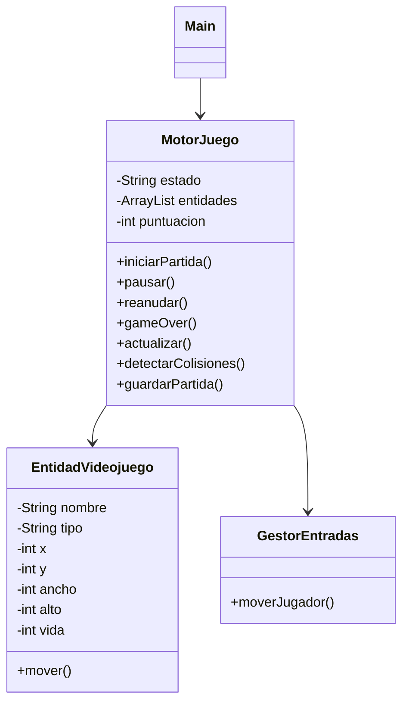
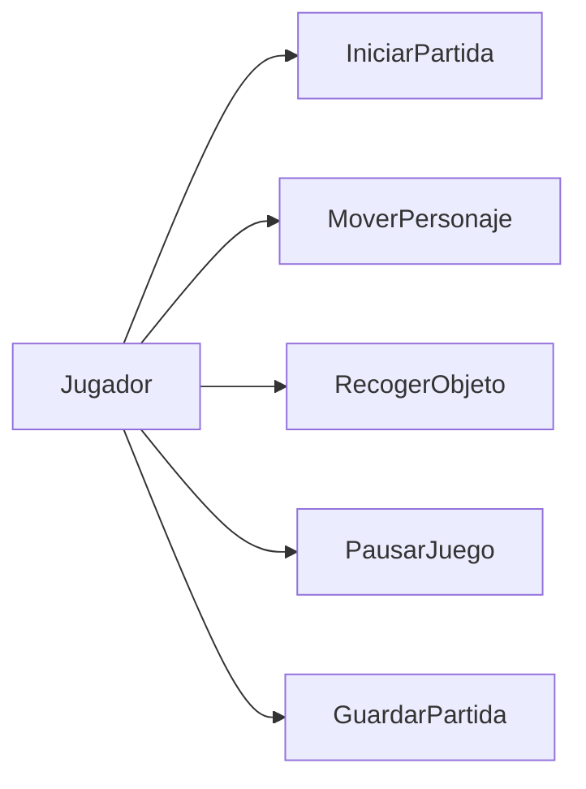

# 🎮 Motor de Videojuego 2D - IA Assisted

## 📌 Descripción del proyecto

Este proyecto consiste en el desarrollo de un motor básico de videojuego 2D tipo cuadrícula, donde el jugador controla una entidad que puede moverse, recoger objetos y evitar enemigos.

El objetivo no es crear un videojuego completo, sino simular la arquitectura de un motor de juego con gestión de entidades, colisiones, estados de juego y guardado de partida.

---

## 🧠 Arquitectura del sistema

El sistema está compuesto por 4 clases principales:

### 1. Main

Clase principal encargada de ejecutar la simulación del juego y probar la lógica del motor.

### 2. MotorJuego

Es el núcleo del sistema. Controla:

* Estado del juego (MENU, JUGANDO, PAUSA, GAME OVER)
* Gestión de entidades
* Lógica del game loop
* Colisiones
* Sistema de puntuación
* Guardado rápido

### 3. EntidadVideojuego

Representa cualquier objeto del juego:

* Jugador
* Enemigos
* Monedas

Contiene:

* Coordenadas (x, y)
* Tamaño (w, h)
* Vida
* Tipo
* Imagen

### 4. GestorEntradas

Simula los controles del jugador (ARRIBA, ABAJO, IZQUIERDA, DERECHA).

---

## 📊 Diagrama de clases UML (Mermaid)

---

## 🎮 Diagrama de casos de uso

---

## 📌 Casos de uso

### 🟢 CU-01 Iniciar Partida

| Campo               | Descripción                                                                        |
| ------------------- | ---------------------------------------------------------------------------------- |
| Nombre              | CU-01 Iniciar Partida                                                              |
| Objetivo            | Iniciar una nueva partida                                                          |
| Actor Principal     | Jugador                                                                            |
| Precondiciones      | El juego está en estado MENU                                                       |
| Flujo Principal     | 1. El jugador inicia el juego 2. El motor cambia a JUGANDO 3. Se generan entidades |
| Flujos Alternativos | El juego ya está en curso                                                          |
| Postcondiciones     | El juego comienza correctamente                                                    |
| Reglas de negocio   | No se puede iniciar si ya está en JUGANDO                                          |

---

### 🟡 CU-02 Guardar Partida

| Campo               | Descripción                                                                                           |
| ------------------- | ----------------------------------------------------------------------------------------------------- |
| Nombre              | CU-02 Guardar Partida                                                                                 |
| Objetivo            | Guardar el estado actual del juego                                                                    |
| Actor Principal     | Jugador                                                                                               |
| Precondiciones      | El juego está en JUGANDO                                                                              |
| Flujo Principal     | 1. El jugador solicita guardado 2. El motor genera un string con el estado 3. Se devuelve el guardado |
| Flujos Alternativos | No hay jugador activo                                                                                 |
| Postcondiciones     | Estado del juego guardado                                                                             |
| Reglas de negocio   | Solo se puede guardar en partida activa                                                               |

---

## 🤖 Bitácora de uso de Inteligencia Artificial

### Herramienta utilizada

ChatGPT (OpenAI)

### Uso de prompts

**Prompt 1:**

> Diseña un motor de videojuego 2D en Java con máximo 4 clases respetando estructura orientada a objetos.

**Prompt 2:**

> Implementa detección de colisiones y sistema de guardado rápido en un motor de juego en Java.

### Error de la IA y corrección

Inicialmente la IA proponía dividir el juego en demasiadas clases (Jugador, Enemigo, Moneda separadas).
Esto superaba el límite del enunciado.

Se corrigió unificando todo en la clase `EntidadVideojuego` usando un atributo `tipo`.

### Reflexión crítica

El uso de IA acelera el desarrollo y ayuda a estructurar sistemas complejos, pero puede:

* Generar sobreingeniería
* Ignorar restricciones del ejercicio
* Proponer soluciones demasiado avanzadas

Por eso es necesario supervisar y adaptar el código manualmente.

---

## 📌 Conclusión

El proyecto simula correctamente un motor básico de videojuego 2D con gestión de entidades, colisiones y guardado de partida, cumpliendo los requisitos de la práctica.
